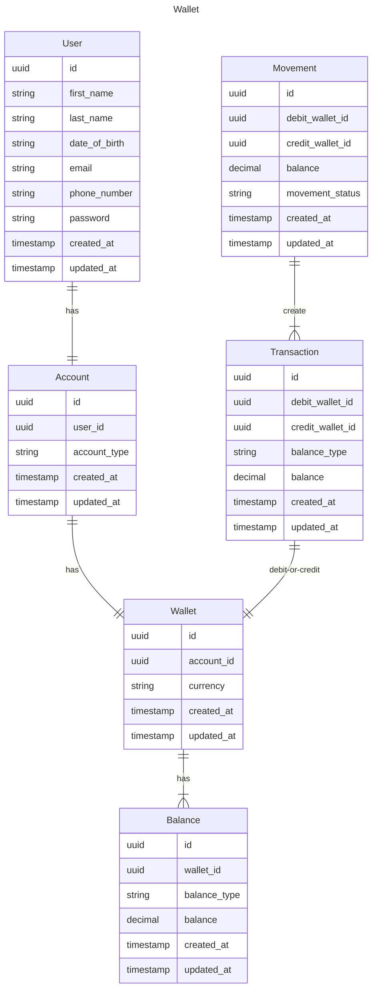
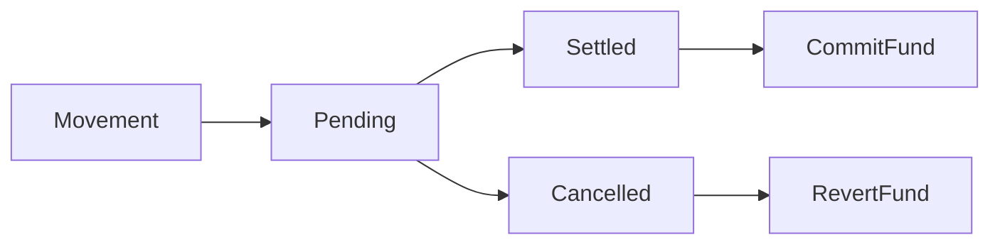
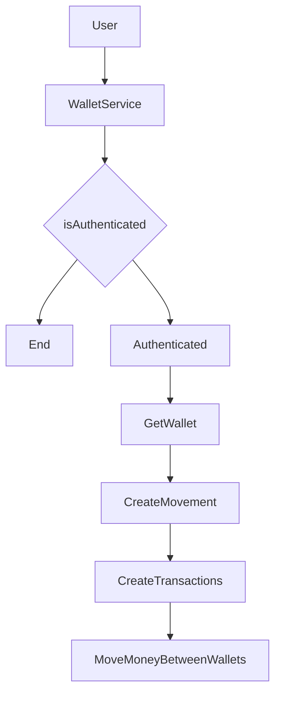

# Wallet
This project is to create a wallet service for PoC.

---
# Tech Stack
- Go 1.23
- Postgresql
- Redis
- Wire
- Gin
- Gorm
- Viper
---
# Prerequisite
- Docker must be installed
- If you get any error related to wire, please install `go get github.com/google/wire/cmd/wire` and make sure `$GOPATH/bin` is in your terminal path
---
# How to run?
1. Spin up necessary dependencies by running `docker-compose up -d`
2. Execute Makefile by running `make` command in your terminal
---

# API Design
- Endpoint follows RESTful style to provide resource-based API
---

# Database Design

---
# Ledger Design Principle
- **Immutability** - Once it is created, change is not allowed
- **Observability** - Funds are observable, alert when unhealthy funds appear
- **Reliability** - Data is consistent and reliable. Data quality is important
- **Traceability** - Transaction logs should be traceable. Able to provide what happens in the system and a particular wallet
---
# Design Consideration
## Keep it simple
Monolith architecture is selected for this PoC. Although we should adopt distributed architecture for better scalability and availability, this is not suitable in this PoC. If we introduce microservices in this PoC, it will overkill the whole design.
Instead, we keep it simple and modular. When we need to split the system into microservices, we can move code to separate project quickly.

## Strong Consistency
Money movement and transaction logs must be strong consistent. Either all operations success or all failed. No partial success is accepted. This is to guarantee data quality in the ledger.

## Traceable
Ledger should maintain traces to keep track all events happened in the platform. All transactions should be traceable includes involved action, parties, money, and when.

## Immutable
Ledger transactions and movements should be append-only. Once it is created, it is not allowed to modify.

## Single Currency
Single Currency design is adopted in this PoC, but we remain the design extensible for multi-currency to cater to business growth.

## Double-entry Bookkeeping
Transactions happened in the ledger should be recorded on both debit and credit wallet so that we can trace the fund movement in the treasury system.

## Accounting
Fund moves to chart account no matter what type of transfers. To keep it simple, we have:
1. ASSET_ACCOUNT
2. LIABILITY_ACCOUNT

Deposit 10 to User A = User A account + 10, ASSET_ACCOUNT + 10
Withdrawal 10 from User A = User A account - 10, LIABILITY_ACCOUNT + 10
Transfer 10 from User A to User B = User A account - 10, User B account + 10, LIABILITY_ACCOUNT + 10, LIABILITY_ACCOUNT - 10

## Money Movement
Money Movement should have multiple statuses to indicate whether a fund is settled, pending or cancelled. In this PoC, since we don't have any payment gateway, we will assume all transactions are settled. But in the future, we can add more statuses to indicate the fund movement status.

## Wallet Status
In real-world scenario, we might need to close account/wallet for some reason. For example, user account is closed, or wallet is closed. In this PoC, we will assume all wallets are open and available for money movement.

---
# Architecture
## Wallet Domain

## Wallet Flow

# Future Iteration - Out of Scope but Worth to Explore
## Observability
Funds should be observable so that the engineering team and operation team can learn the current funds state.
It indicates whether the treasury system is healthy or not. If any abnormal happens, an alert should be triggered.
Also, a dashboard or portal should be developed to track system health.

## Traceability
The data in the ledger is traceable which we can utilize the data for better traceability by creating tool to trace funds and provide audit data. We can search action logs in the platform or input a trace id to trace fund state and flow.

## Access Control
Ledger should provide a role-based access control to limit what services can do what actions so that we can reduce potential risk with minimum access authorized. Any illegal actions should be rejected and alerted.

## Efficient Aggregation
Ledger as a treasury core and source of truth for money movement. 
It should be able to aggregate money efficiently for different use cases, for example, operational use cases, reconciliation use cases, and safeguarding use cases. It should allow balance snapshot or aggregate balance in any timeframe.

## Partition
Ledger is a data intensive application which we need to store any movement to the system. When the business growth, we need to design the storage in partition or sharding so that we can provide more scalability to the system.

## Hot/Cold Data Separation
Hot/Cold Data Separation can also improve scalability when data grow quickly. This can improve both read and write performance in huge data size scenarios.

# Treasury System Big Picture
